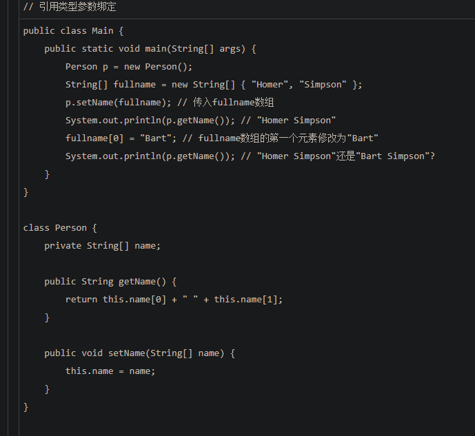

# LearnJava
没想写什么，就是你看什么看，赶紧学完Java基本知识去
教程：https://www.liaoxuefeng.com/wiki/1252599548343744/1259544070059520
### .iml文件
idea 对module 配置信息之意， infomation of module。每个模块都有一个iml文件。

IDEA中的.iml文件是项目标识文件，缺少了这个文件，IDEA就无法识别项目。跟Eclipse的.project文件性质是一样的。并且这些文件不同的设备上的内容也会有差异，所以我们在管理项目的时候，.project和.iml文件都需要忽略掉。
————————————————
版权声明：本文为CSDN博主「顺其自然~」的原创文章，遵循CC 4.0 BY-SA版权协议，转载请附上原文出处链接及本声明。
原文链接：https://blog.csdn.net/fuhanghang/article/details/108766128
### .idea文件夹：存放项目的配置信息
包括数据源，类库，项目字符编码，历史记录，版本控制信息等。
# 基础
## public static
Java入口程序规定的方法必须是静态方法，方法名必须为main，括号内的参数必须是String数组。
## 注释

## 基本数据类型
基本数据类型是CPU可以直接进行运算的类型。Java定义了以下几种基本数据类型：

整数类型：byte，short，int，long

浮点数类型：float，double

字符类型：char

布尔类型：boolean
## 形象的图

## 布尔类型呢？
Java语言对布尔类型的存储并没有做规定，因为理论上存储布尔类型只需要1 bit，但是通常JVM内部会把boolean表示为4字节整数。
## 除了以上，均是引用类型。
引用类型的变量类似于C语言的指针，它内部存储一个“地址”，指向某个对象在内存的位置
## 常量
如果加上final修饰符，这个变量就变成了常量
## var关键字？

## 浮点数比较
格外注意，**比较两个浮点数是否相等**常常会出现错误的结果。正确的比较方法是判断两个浮点数之差的绝对值是否小于一个很小的数：
## 三月运算符
Java还提供一个三元运算符b ? x : y，它根据第一个布尔表达式的结果，分别返回后续两个表达式之一的计算结果。
## 多行字符
从Java 13开始，字符串可以用"""..."""表示多行字符串（Text Blocks）
## ""和空值和null不一样
## 二维数组
才知道！Java中二维数组每行长度可以不一样

## 一个Java源文件可包含多个类
一个Java源文件可以包含多个类的定义，但只能定义一个public类，且public类名必须与文件名一致。如果要定义多个public类，必须拆到多个Java源文件中。
## field
表示字段，并不是我想当然的啥领域
# 对于我来说的新内容
## 参数绑定
调用方把参数传递给实例方法时，调用时传递的值会按参数位置一一绑定。
？？？啥意思

1)结论：基本类型参数的传递，是调用方值的复制。双方各自的后续修改，互不影响。
2)结论：引用类型参数的传递，调用方的变量，和接收方的参数变量，指向的是同一个对象。
鲍：引用类型，本身存放的是地址咯
### 把我唬得一愣一愣的例子

对了，附上符合我思维的例子：

我以为答案是Alice呢，其实原因就是对数组元素重新赋值，是更改了对应内存空间的值，而对String对象进行赋值，对应内存空间的值不变，变的是引用类型，也就是变了指针。
### 答案：

外部的指针指向了新名字Alice，但是实例p的指针指向的是Bob。就理解成指针完事儿，外部指针变了，实例p还是指向原来的地址。

fullname[0]操作之后，数组中两个指针中的第一个就变了。然后，实例p用的也是这个数组。
# 继承
父类称为 超类、父类、基类
子类称为子类、拓展类
所有类都是object的子类噢，如下图所示：

## 子类无法访问父类的私有字段（field）、方法
这使得继承的作用削弱了，解决方案：将父类的权限设置为protected。
# 构造方法
在Java中，任何class的构造方法，第一行语句必须是调用父类的构造方法。
即
学生类是人类的子类，学生类的每一个构造方法，第一行语句必须是调用父类的构造方法。
**注意**:子类不会继承任何父类的构造方法。
# 阻止继承
正常情况下，只要某个class没有final修饰符，那么任何类都可以从该class继承。
# 向上转型
现在问题来了：如果Student是从Person继承下来的，那么，一个引用类型为Person的变量，能否指向Student类型的实例？

总结：向上转型实际上是把一个**子类型** **变为** 更加抽象的**父类型**。\
# 向下转型
反过来，想想继承树即可，树根肯定是父类，向下，就是把父类转子类。
# 小节
Java只允许单继承，所有类最终的根类是Object
# @Override
在继承关系中，子类如果定义了一个与父类方法签名(bao：签名我的理解就是返回值、参数呗)完全相同的方法，被称为覆写（Override）
作用是叫编译器检查我们重写的方法是不是写对签名了
# 多态
多态是指，针对某个类型的方法调用，其真正执行的方法取决于运行时期实际类型的方法。

好绕口，总结一下：多态指的是：某个类的方法调用，真正执行哪个方法呢，存在多种可能。

也就是，运行的时候才能决定调用哪个子类方法。
## 目前的理解，用个实际例子就记住了

编写了一个父类为Person，继承于Person编写了两个类，一个是Student，一个是Teacher，在Person类中写了run方法，在Student和Teacher类中也分别重写了Run方法。接着，这时候编写一个方法runTwice次，参数是Person，里面就是调用run方法两次，
那这时候形参是Person类型，但是我们不能保证传入的参数实际上是Person类型的、还是Student类型、又或者是Teacher类型
（学生类、老师类都可以向上转型成人类）
## 笔记+1

## 那么多态有什么用？来个具体的例子
报税例子，父类为Income，子类有工资的部分、享受国务院特殊津贴的部分，税的比例是不一样的。

现在，我们要编写一个报税的财务软件，对于一个人的所有收入进行报税，就很简单咯

注：各种工资都是属于Income，但是各自有各自的特征，运行的时候调用自己的那个特征。就比如报税，收入是父类，子类有工资、开公司吧啦吧啦，各种收入的纳税比例不一样，就是多态咯，计算全部税很方便的，调用同一个方法名就行，但是具体执行的时候，实际上，是不同的动作。

