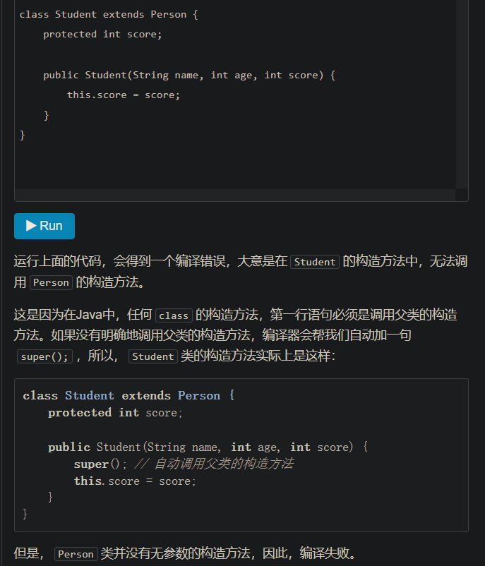

# LearnJava
没想写什么，就是你看什么看，赶紧学完Java基本知识去
教程：https://www.liaoxuefeng.com/wiki/1252599548343744/1259544070059520
### .iml文件
idea 对module 配置信息之意， infomation of module。每个模块都有一个iml文件。

IDEA中的.iml文件是项目标识文件，缺少了这个文件，IDEA就无法识别项目。跟Eclipse的.project文件性质是一样的。并且这些文件不同的设备上的内容也会有差异，所以我们在管理项目的时候，.project和.iml文件都需要忽略掉。
————————————————
版权声明：本文为CSDN博主「顺其自然~」的原创文章，遵循CC 4.0 BY-SA版权协议，转载请附上原文出处链接及本声明。
原文链接：https://blog.csdn.net/fuhanghang/article/details/108766128
### .idea文件夹：存放项目的配置信息
包括数据源，类库，项目字符编码，历史记录，版本控制信息等。
# 基础
## public static
Java入口程序规定的方法必须是静态方法，方法名必须为main，括号内的参数必须是String数组。
## 注释

## 基本数据类型
基本数据类型是CPU可以直接进行运算的类型。Java定义了以下几种基本数据类型：

整数类型：byte，short，int，long

浮点数类型：float，double

字符类型：char

布尔类型：boolean
## 形象的图

## 布尔类型呢？
Java语言对布尔类型的存储并没有做规定，因为理论上存储布尔类型只需要1 bit，但是通常JVM内部会把boolean表示为4字节整数。
## 除了以上，均是引用类型。
引用类型的变量类似于C语言的指针，它内部存储一个“地址”，指向某个对象在内存的位置
## 常量
如果加上final修饰符，这个变量就变成了常量
## var关键字？

## 浮点数比较
格外注意，**比较两个浮点数是否相等**常常会出现错误的结果。正确的比较方法是判断两个浮点数之差的绝对值是否小于一个很小的数：
## 三月运算符
Java还提供一个三元运算符b ? x : y，它根据第一个布尔表达式的结果，分别返回后续两个表达式之一的计算结果。
## 多行字符
从Java 13开始，字符串可以用"""..."""表示多行字符串（Text Blocks）
## ""和空值和null不一样
## 二维数组
才知道！Java中二维数组每行长度可以不一样

## 一个Java源文件可包含多个类
一个Java源文件可以包含多个类的定义，但只能定义一个public类，且public类名必须与文件名一致。如果要定义多个public类，必须拆到多个Java源文件中。
## field
表示字段，并不是我想当然的啥领域
# 对于我来说的新内容
## 参数绑定
调用方把参数传递给实例方法时，调用时传递的值会按参数位置一一绑定。
？？？啥意思

1)结论：基本类型参数的传递，是调用方值的复制。双方各自的后续修改，互不影响。
2)结论：引用类型参数的传递，调用方的变量，和接收方的参数变量，指向的是同一个对象。
鲍：引用类型，本身存放的是地址咯
### 把我唬得一愣一愣的例子

对了，附上符合我思维的例子：

我以为答案是Alice呢，其实原因就是对数组元素重新赋值，是更改了对应内存空间的值，而对String对象进行赋值，对应内存空间的值不变，变的是引用类型，也就是变了指针。
### 答案：

外部的指针指向了新名字Alice，但是实例p的指针指向的是Bob。就理解成指针完事儿，外部指针变了，实例p还是指向原来的地址。

fullname[0]操作之后，数组中两个指针中的第一个就变了。然后，实例p用的也是这个数组。
# 继承
父类称为 超类、父类、基类
子类称为子类、拓展类
所有类都是object的子类噢，如下图所示：

## 子类无法访问父类的私有字段（field）、方法
这使得继承的作用削弱了，解决方案：将父类的权限设置为protected。
# 构造方法
在Java中，任何class的构造方法，第一行语句必须是调用父类的构造方法。
即
学生类是人类的子类，学生类的每一个构造方法，第一行语句必须是调用父类的构造方法。
**注意**:子类不会继承任何父类的构造方法。
# 阻止继承
正常情况下，只要某个class没有final修饰符，那么任何类都可以从该class继承。
# 向上转型
现在问题来了：如果Student是从Person继承下来的，那么，一个引用类型为Person的变量，能否指向Student类型的实例？

总结：向上转型实际上是把一个**子类型** **变为** 更加抽象的**父类型**。\
# 向下转型
反过来，想想继承树即可，树根肯定是父类，向下，就是把父类转子类。
（转型成功的条件是：实际类型就是这个子类的类型，否则会转型失败，子类方法、字段只会比父类多，不会比父类少）
# 小节
Java只允许单继承，所有类最终的根类是Object
# @Override
在继承关系中，子类如果定义了一个与父类方法签名(bao：签名我的理解就是返回值、参数呗)完全相同的方法，被称为覆写（Override）
作用是叫编译器检查我们重写的方法是不是写对签名了
# 多态
多态是指，针对某个类型的方法调用，其真正执行的方法取决于运行时期实际类型的方法。

好绕口，总结一下：多态指的是：某个类的方法调用，真正执行哪个方法呢，存在多种可能。

也就是，运行的时候才能决定调用哪个子类方法。
## 目前的理解，用个实际例子就记住了

编写了一个父类为Person，继承于Person编写了两个类，一个是Student，一个是Teacher，在Person类中写了run方法，在Student和Teacher类中也分别重写了Run方法。接着，这时候编写一个方法runTwice次，参数是Person，里面就是调用run方法两次，
那这时候形参是Person类型，但是我们不能保证传入的参数实际上是Person类型的、还是Student类型、又或者是Teacher类型
（学生类、老师类都可以向上转型成人类）
## 笔记+1

## 那么多态有什么用？来个具体的例子
报税例子，父类为Income，子类有工资的部分、享受国务院特殊津贴的部分，税的比例是不一样的。

现在，我们要编写一个报税的财务软件，对于一个人的所有收入进行报税，就很简单咯

注：各种工资都是属于Income，但是各自有各自的特征，运行的时候调用自己的那个特征。就比如报税，收入是父类，子类有工资、开公司吧啦吧啦，各种收入的纳税比例不一样，就是多态咯，计算全部税很方便的，调用同一个方法名就行，但是具体执行的时候，实际上，是不同的动作。
## 子类调用父类的构造方法

重点如上。
## final字段表示这是最后一次赋值
但是，**可以在构造方法中初始化final字段。**
# 多态性小节

# 抽象类
## 抽象方法作用
抽象方法实际上相当于定义了“规范”。
# 接口！（冲呀）
如果一个抽象类没有字段，所有方法全部都是抽象方法，
那，就可以把该抽象类改写为接口：interface。
## 一个类可实现多个接口
在Java中，一个类只能继承自另一个类，不能从多个类继承。但是，一个类可以实现多个interface

注：implement就是实现、实施的意思噢
## 接口总结（挺懵逼，先专注于看得懂的，然后后面一点点弄懂）

# 记住一个宗旨，就算是看着别人的代码抄，也要多写代码，光看不行的~
# 静态字段、方法
## 接口
因为interface是一个纯抽象类，所以它不能定义实例字段。但是，interface是可以有静态字段的，并且静态字段必须为final类型。
# 包
包类比到C++中，就算命名空间，解决函数名字冲突用的。
## 建议都写上包
没有定义包名的class，它使用的是默认包，非常容易引起名字冲突，因此，不推荐不写包名的做法。
## 不同包里面有重名的方法的话
如果有两个class名称相同，例如，mr.jun.Arrays和java.util.Arrays，那么只能import其中一个，另一个必须写完整类名。
# 作用域
## public
1)定义为public的class、interface可以被其他任何类访问.
2)定义为public的field、method可以被其他类访问，前提是首先有访问class的权限.
## private
1)定义为private的field、method无法被其他类访问.
2)确切地说，private访问权限被限定在class的内部，而且与方法声明顺序无关。推荐把private方法放到后面，因为public方法定义了类对外提供的功能，阅读代码的时候，应该先关注public方法
## protected
protected作用于继承关系。定义为protected的字段和方法可以被子类访问，以及子类的子类.
## 包没有父子关系
com.apache和com.apache.abc是不同的包。
## 包作用域

反正总结：包作用域指的是一个类允许访问同一个包下，没有public protected private 修饰的class、filed、method（除了protected修饰的class也可以访问）
# 局部变量越迟声明越好
使用局部变量时，应该尽可能把局部变量的作用域缩小，尽可能延后声明局部变量。
# final
阻止继承、覆写，PS:可以使用在形参中，阻止被再赋值（那就跟const作用一样）
# 是否要有public的建议

不确定要不要用public，那就不要用。
# 四个修饰符情况
public          公共的，所有人都可以访问
无修饰符         友好的，允许同一个包访问
protected       受保护的，允许自身+子类
private         私有的，只有自身可访问
# 匿名类
之所以我们要定义匿名类，是因为在这里我们通常不关心类名。
## 内部类一堆，懵逼，第一遍，先跳过咯
# 题外话，测试四大步骤
单元测试（每个方法咯，注意点：不要调用未测试过的方法）
接着是，集成测试，走流程咯
接着是：系统测试，部署到生产环境中
最后是验收测试：由用户来完成

即黑盒：不在意你具体怎么实现，我就根据说明书拿来用。检测输出结果对不对。

白盒，能看见内部，我们在不同点检查程序状态是否正确。

# 测试总结
和测试直接相关的是单元测试、集成测试、系统测试、验收测试。

（白盒测试为主导，黑盒为辅助）单元测试，主要关注在单个模块的测试，用来检验每一个**独立的模块**是否满足客户的需求；（单个模块）

（黑盒为主导，白盒为辅助）集成测试，主要关注在**模块之间的**测试，用来检验**多模块之间的连接正确性**，确保多功能**业务**的正确性；（业务流程，模块之间）

（完全黑盒）系统测试，主要是站在整个系统的高度去全面的检验产品的质量；（站系统角度，部署到具体环境中）

（完全黑盒）验收测试，一般是由客户主导或授权的验证软件的实现是否真正的满足客户的需求。（一般由用户主导）
# 跑题了，回来回来
classpath：指明用到的类在哪个路径下的，IDE默认是 . 即当前目录下。
jar:因为.class字节码文件散落在各层目录中，不便于管理，所以就用jar包把目录打成一个包。jar包本质是一个zip格式的压缩文件，它可以把package阻止的目录级别、所有文件打包起来。
Maven：就是用了创建jar包用的一个开源工具。
## 打包jar、模块
看得我一脸懵逼，先跳过，后续学习再逐步融合进来~战略性跳过
# Java核心类
回忆基本数据类型，
整数byte short int long
浮点数 float double 
字符 char
布尔 boolean
## 字符串和编码
String是一个引用类型，但是Java编译器对String有特殊处理，所以可以 String a = “apple”;
### 编码
UTF-8编码是一个变长编码，用来把Unicode码是固定字节（4字节）变成1-4字节变长。
## StringBuilder类
String是能直接加减，但是是临时对象，会浪费内存。为了高效拼接字符串，所以提供了StringBuilder类，可以预分配缓冲区。
### 链式操作
不断返回自身指针即可，即返回this

# 包装类
8种基本类型都有其包装类。
# 程序的设计有一个原则
数据的存储和显示要分离
# 无符号整型
Java中，并没有无符号整型的基本数据类型。byte short int long 都是带符号整型。
# 异常（新知识）
##一种class 首先
Error表示严重的错误，程序对此一般无能为力，而Exception则是运行时的错误，它可以被捕获并处理。
## 捕获异常
用try...catch 语句，把可能发生异常的代码放到try{...}中，然后使用catch捕获对应的Exception及其子类

